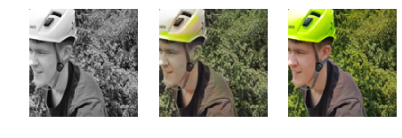
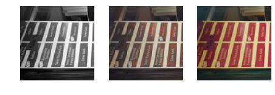
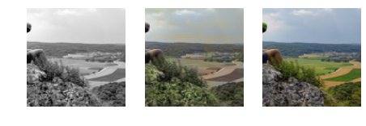
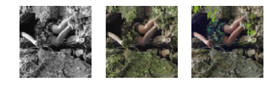
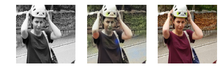

# Колоризация изображения

Колоризация изображения с использованием сверточных сетей

Слева направо: grayscale изображение, разукрашенное с помощью нейронной сети, и оригинальное изображение

Интенсивность некоторых цветов одинакова и неотличима на черно-белых версиях

